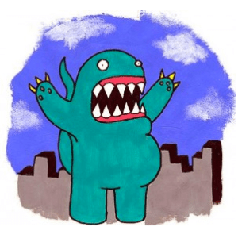

# MovieMonsters
A b-grade monster movie game using the LÖVE framework (www.love2d.org).

Set in the early days of movies and cinema - where cheesy B-Grade horror and disaster movies ruled.

This particular movie is about a monster and a city, however instead of playing the _good_ guy, you get to play the monster.

How would you play our monster? Do you cause lots of destruction and chaos, or are you just wanting a bite to eat? Do you just want to find a friendly person to hug? It isn't going to be easy when you have the whole city against you!

  

*Note: This game is under heavy construction*

## Pre-Release/Prototype

MovieMonsters is currently in the prototype stage and in an unplayable state. You can however download a [pre-release](https://github.com/Philbywhizz/MovieMonsters/releases) version and provide feedback either through [discussions](https://github.com/Philbywhizz/MovieMonsters/discussions) board or by creating an [issue](https://github.com/Philbywhizz/MovieMonsters/issues).

